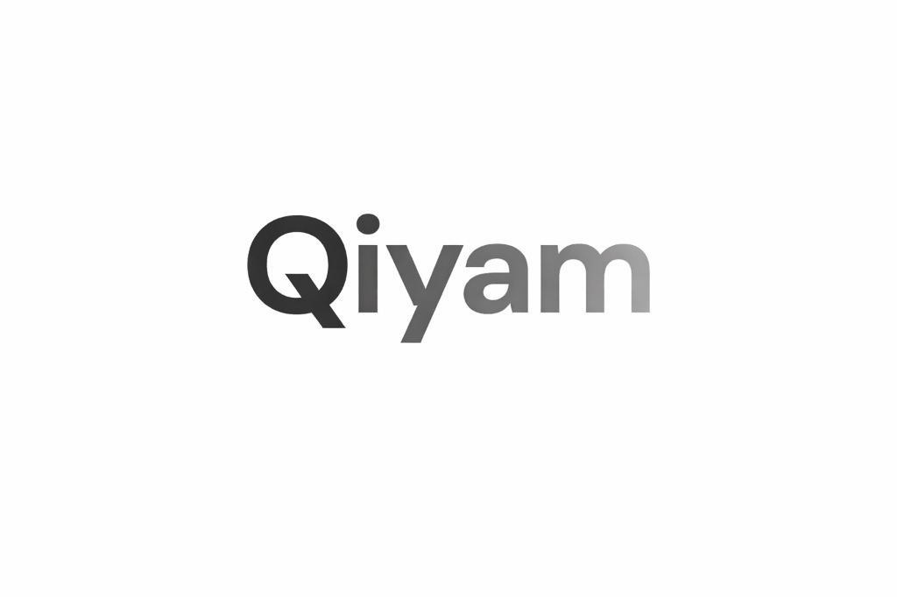

  

# Qiyam 🌙

A premium, glassy web application designed to calculate the **Last Third of the Night (Qiyam/Tahajjud)** with precision. Built for spiritual focus and clarity, Qiyam takes the guesswork out of night prayer by providing real-time countdowns, visual progress, and inspirational virtues.

## ✨ Features

- **Precise Qiyam Window**: Calculates the exact start and end of the last third of the night.
- **Dual Calculation Conventions**:
  - **Standard**: Maghrib to Fajr.
  - **Alternative**: Isha to Fajr.
- **Dynamic Location Detection**:
  - **Auto-GPS**: Locates you instantly upon mount.
  - **Smart Search**: Integrated city autocomplete via Open-Meteo & Aladhan APIs.
- **Visual Insights**:
  - **Live Countdown**: See exactly how much time is left until the window starts.
  - **Night Progress Bar**: Track the progression of the night from Sunset to Dawn.
- **Spiritual Motivation**: Randomly curated virtues (Hadiths and quotes) about night prayer.
- **Premium Design**:
  - **Glassmorphism UI**: Beautiful, translucent interface that feels modern and lightweight.
  - **Dark/Light Mode**: Seamlessly toggles between Frost (Light) and Obsidian (Dark) themes.
  - **Responsive**: Fully optimized for both desktop and mobile devices.
- **Copy Summary**: One-click sharing of your night prayer schedule.

## 🛠️ Tech Stack

- **Framework**: [Next.js 14](https://nextjs.org/) (App Router)
- **Styling**: [Tailwind CSS](https://tailwindcss.com/) with Custom Glassmorphism
- **Data Fetching**: [@tanstack/react-query](https://tanstack.com/query/latest)
- **State Management**: React Hooks & LocalStorage for persistent settings
- **API Integration**: Aladhan API, Open-Meteo Geocoding, OpenStreetMap (Nominatim)
- **UI Components**: Radix UI & Lucide Icons
- **Validation**: [Zod](https://zod.dev/)

## 🚀 Getting Started

### Prerequisites
- Node.js 18.x or later
- npm or yarn

## 🗺️ User Journey

1. **Initial Access**: Upon opening the app, it automatically attempts to retrieve your GPS location to provide local prayer times immediately.
2. **Setting the Location**: If GPS is unavailable, use the **Search** tab to find your city with real-time suggestions.
3. **Calculating the Window**: The "Qiyam Window" displays the optimal time for the third third. The app handles "early morning" logic—if you open it at 3:00 AM, it shows you the currentactive window rather than skipping to the next night.
4. **Monitoring Progress**: Use the **Countdown** to prepare for your prayer and the **Night Progress Bar** to see where you are between Sunset and Dawn.
5. **Customization**: Open the **Settings** (gear icon) to switch between 12h/24h formats, change your calculation method (e.g., MWL, ISNA), or switch the Qiyam convention.
6. **Sharing**: Click **Copy Summary** to get a formatted list of times to save in your notes or share with others.

## 📄 License

This project is licensed under the MIT License - see the LICENSE file for details.

*May your Qiyam be accepted.* Keep Developer Abdullah Rahman in your duas🤲
